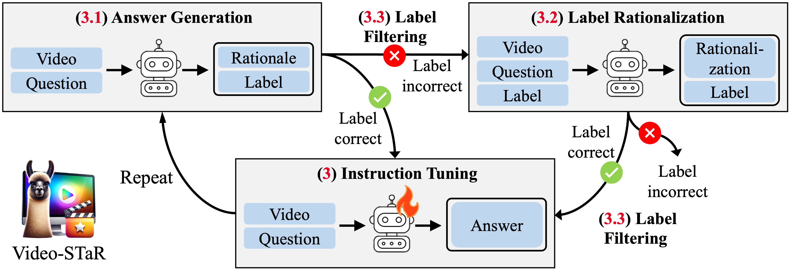
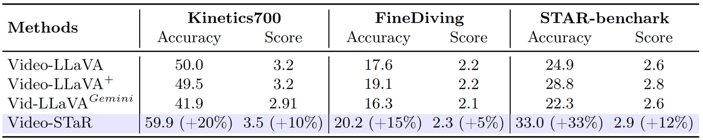
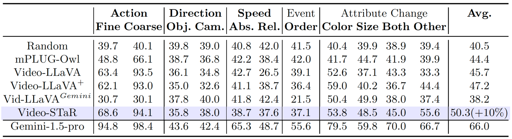
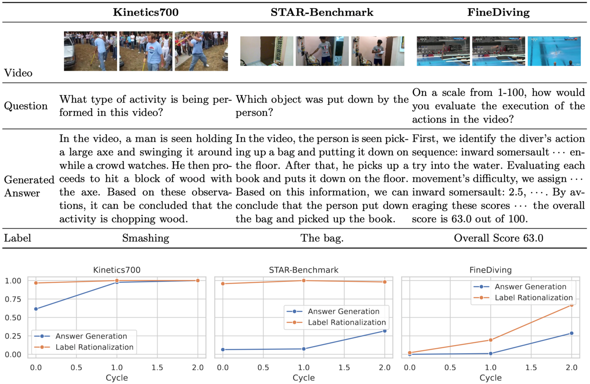

<p align="center">
    
<p>
<h2 align="center"> <a href="https://arxiv.org/2407.06189">Video-STaR: Self-Training Enables Video Instruction Tuning with Any Supervision</a></h2>
<h5 align="center"> If you like our project, please give us a star ⭐ on GitHub for latest update.  </h2>


<h5 align="center">
    
[](https://huggingface.co/spaces/orrzohar/Video-STaR)
[](https://arxiv.org/abs/2407.06189)
[](https://github.com/orrzohar/Video-STaR/blob/main/LICENSE) 
[](https://hits.seeyoufarm.com)
[](https://github.com/orrzohar/Video-STaR/issues?q=is%3Aopen+is%3Aissue)
[](https://github.com/orrzohar/Video-STaR/issues?q=is%3Aissue+is%3Aclosed) 
</h5>

## 📣 Announcements
* **[2024.7.10]**  🚀 planned release of codebase!


## 📰 News
* **[2024.7.9]**  💫  [VSTaR-1M released](https://huggingface.co/datasets/orrzohar/Video-STaR)!
* **[2024.7.9]**  📄  [arXiv released](https://arxiv.org/abs/2407.06189)
* **[2024.6.20]**  🤗 [Hugging Face demo](https://huggingface.co/spaces/orrzohar/Video-STaR) released - you are welcome to explore the VSTaR-1M dataset
* **[2024.6.17]**  🔥 README release


## 😮 Highlights



### 🔥 Adapt any Large Visual-Language Model to any task using any supervision
Video-STaR can adapt LVLMs to diverse downstream tasks and datasets




### 🚀 Self-improve Large Visual-Language Models using any labeled video dataset
Models utilizing Video-STaR show improvement on visual understanding datasets -  like [Temporal Compass](https://github.com/llyx97/TempCompass):



### 🎥 Introduction of a large, diverse video instruction tuning dataset




## 🛠️ Requirements and Installation
* Python >= 3.10
* Pytorch == 2.0.1
* CUDA Version >= 11.7
* Install required packages:
```bash
git clone https://github.com/orrzohar/Video-STaR
cd Video-STaR
conda create -n videostar python=3.10 -y
conda activate videostar
pip install --upgrade pip  # enable PEP 660 support
pip install -e .
pip install -e ".[train]"
pip install flash-attn --no-build-isolation
pip install decord opencv-python git+https://github.com/facebookresearch/pytorchvideo.git@28fe037d212663c6a24f373b94cc5d478c8c1a1d
```


## 🗝️ Training & Validating

## 👍 Acknowledgement
* [LLaVA](https://github.com/haotian-liu/LLaVA) The codebase we built upon.
* [Video-ChatGPT](https://github.com/mbzuai-oryx/Video-ChatGPT) Great job contributing the evaluation benchmark and VI-100K dataset.
* [Video-LLaVA](https://github.com/PKU-YuanGroup/Video-LLaVA) Base Model.
* [LLaMA-VID](https://github.com/dvlab-research/LLaMA-VID) Base Model.

## 🙌 Related Projects
* More coming soon... 
* [Video-Agent](https://wxh1996.github.io/VideoAgent-Website/)

## 🔒 License
* The majority of this project is released under the Apache 2.0 license as found in the [LICENSE](https://github.com/orrzohar/Video-star/blob/main/LICENSE) file.
* The service is a research preview intended for non-commercial use only, subject to the model [License](https://github.com/facebookresearch/llama/blob/main/MODEL_CARD.md) of LLaMA, [Terms of Use](https://openai.com/policies/terms-of-use) of the data generated by OpenAI, and [Privacy Practices](https://chrome.google.com/webstore/detail/sharegpt-share-your-chatg/daiacboceoaocpibfodeljbdfacokfjb) of ShareGPT. Please contact us if you find any potential violation.

## ✏️ Citation
If you find our paper and code useful in your research, please consider giving a star :star: and citation :pencil:.
```BibTeX
@inproceedings{zohar2024videostar,
    title = {Video-STaR: Self-Training Enables Video Instruction Tuning with Any Supervision},
    author = {Zohar, Orr and Wang, Xiaohan and Bitton, Yonatan and Szpektor, Idan and Yeung-levy, Serena},
    year = {2024},
    booktitle = {arXiv preprint arXiv:2407.06189},
}
```


## ✨ Star History

[](https://star-history.com/#orrzohar/Video-STaR&Date)
